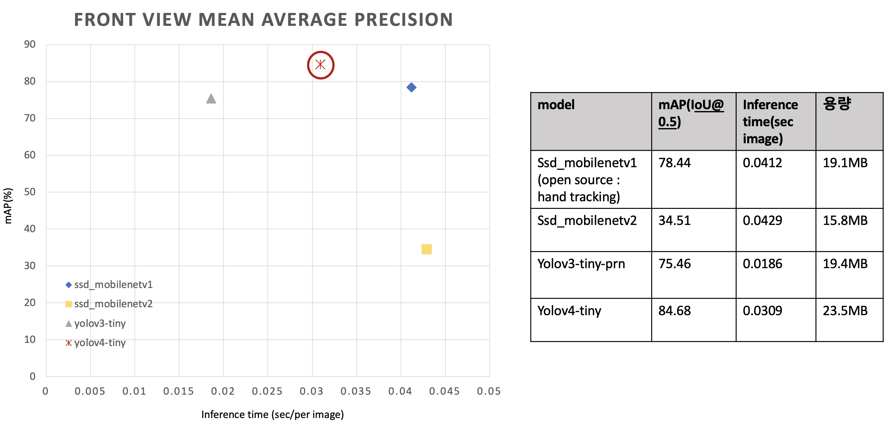
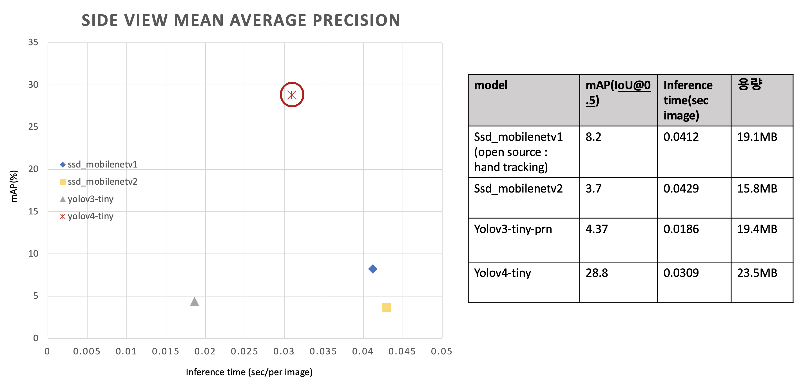
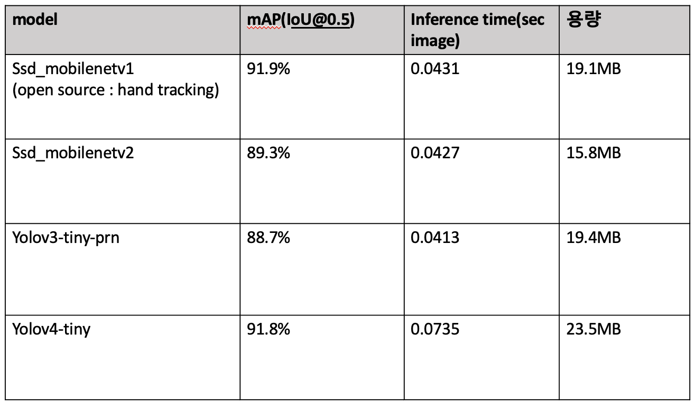
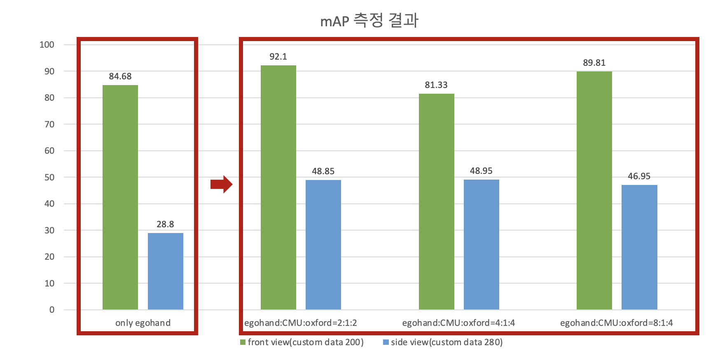

# hand_detection

## analysis result

### 1. 모델 선정
#### condition1
- model : ssd_mobilenetv1, ssd_mobilenetv2, yolov4-tiny, yolov3-tiny
- train data : Egohands dataset
- test data : custom data (labeling in person)
  - front view : 200
  - side view : 280


<br />

##### test mAP & inference time & memory 
###### front view


###### side view (280 images)


##### validation mAP & inference time & memory (egohand evaluation data(400 images))


<br />

#### 선택 모델
<mark style='background-color: #dcffe4'><b>yolov4-tiny</b></mark>

#### 모델 선정 근거
시간 관계상 open source에서 제공되는 ssdmobilenetv1은 모델 구조와 모델 가중치를 포함하는 .pb 를 그대로 사용하고, ssdmobilenetv2, yolov3-tiny-prn, yolov4-tiny에 대해서는 데이터를 수정하고, model config를 수정하여 직접 학습하였다.
  
validation set은 test data와 유사하기 때문에 높은 mAP를 보였지만, 자체 제작한 test 에서는 모두 성능이 떨어졌다.
그나마 general하게 작동하는 모델이 yolov4-tiny라는 것을 확인할 수 있다. 

yolov4의 경우, 기존의 YOLO에 Bag of freebies, Bag of specials 성능 향상 기법을 추가하고, universal한 feature를 추출하여 학습할 수 있도록 하였기 때문에 이와 같은 결과가 나왔을 것이라 생각한다. 
  
따라서 <mark style='background-color: #dcffe4'>yolov4-tiny</mark>에 다양한 각도의 hand data를 추가하여 fine tuning을 진행해보고자 한다.

<br />
<br />

### 2. 성능 향상 기법 연구 
#### 2-1. dataset 추가 수집 및 비율을 다르게 train & test

##### condition2
- model : yolov4-tiny
- train data : EgoHands dataset, CMU dataset, oxford dataset
- test data : custom data (labeling in person)
  - front view : 200
  - side view : 280

```text
EgoHands , CMU, oxford(train+valid)
(4500 + 1000 + (4000+700)) , (500 + 440 + 800)
- only EgoHands(4500,500)
    - train : 4500 (train.txt)
    - validation : 500 (test.txt)
    - obj.data
    - obj.names
    - yolov4-tiny-custom.cfg

- EgoHands + CMU dataset + oxford = 2:1:2 → dataset을 골고루 섞은 경우 
    - train : 2000 + 1000 + 2000 (train_2_1_2.txt)
    - validation : 500 + 250 + 500 (test_2_1_2.txt)
    - obj_2_1_2.data

- EgoHands + CMU dataset + oxford = 4:1:4  → 데이터 양을 중요시 하는 경우
    - train : 4000 + 1000 + 4000 (train_4_1_4.txt)
    - validation validation :  500+ 200 +600 (test_4_1_4.txt)
    - obj_4_1_4.data

- EgoHands + CMU dataset + oxford = 8:1:4→ 가장 상황과 맞는 EgoHands dataset을 많이 활용하고 싶은 경우
    - train : 4000 + 500 + 2000 (train_8_1_4.txt)
    - validation validation : 500 + 100 + 300 (test_8_1_4.txt)
    - obj_8_1_4.data
```

##### test mAP


<br />

##### 결과 분석
CMU, oxford data를 추가하여 데이터를 다양하게 하였기 때문에 front view, side view에서 눈에 띄게 성능이 향상된 것을 확인할 수 있다.

egohand:CMU:oxford=2:1:2의 경우, 기존 모델과 데이터의 양은 비슷하지만, real domain data들이 추가되었기 때문에 데이터의 다양성으로 기존보다 front view에서 6%, side view에서 20%의 성능을 향상시킬 수 있었다.

egohand:CMU:oxford=4:1:4의 경우, 가장 데이터가 많은 모델이다. side view data가 추가되어 side view에서는 20% 성능을 향상시켰지만, front view data에서는 드라마틱한 성장을 보이지 못하였다. 이를 통해, 데이터의 수가 무조건 많은 것보다 데이터의 품질(다양성)이 중요하다는 것을 알 수 있다.

egohand:CMU:oxford=8:1:4의 경우, front view에서는 약 10%의 향상을 보이고, side view에서는 18%의 성능 향상을 보여주었다. Egohand data가 시험 환경과 비슷할 것이라고 예측하여 Egohands 데이터 비율을 많이 한 것으로, 실제로 Front view에서 가장 높은 mAP를 보여준 것을 확인할 수 있다. 

EgoHands:CMU:oxford 2:1:2과 8:1:4가 성능이 비슷하여, real time WebCamera로 실험해보았다. 그 결과 yolov4-tiny_2_1_2가 background error를 덜 인식하므로 <mark style='background-color: #dcffe4'>yolov4-tiny_2_1_2</mark>를 선택하기로 하였다.

<br />

#### 2-2. 최적의 dataset에서 Bag of Freebies, Bag of specials 적용
##### condition3
- model : yolov4-tiny
- train data : EgoHands dataset, CMU dataset, oxford dataset(선택한 비율)
- test data : custom data (labeling in person)
  - front view : 200
  - side view : 280


<br />
<br />
<br />

## structure
```
.
├── README.md
├── dataset
│   ├── custom
│   │   ├── front_view
│   │   ├── images
│   │   ├── side_view
│   │   ├── ssd_annotations
│   │   ├── test_annotations
│   │   ├── yolo_annotations
│   │   ├── images.txt
│   │   └── xml2txt.py
│   ├── egohand
│   │   ├── egohands_data (will be removed)
│   │   │   ├── _LABELLED_SAMPLES
│   │   ├── images
│   │   ├── mat2txt.py
│   │   ├── ssd_annotations
│   │   ├── temp_annotations
│   │   └── yolo_annotations
│   ├── raw_custom
│   │   ├── video
│   │   └── video2image.py
│   ├── csv2txt.py 
│   ├── tests
│   ├── train
│   └── make_dataset_txt.py
├── modules
│   ├── models
│   │   ├── ssdmobilenetv1
│   │   ├── ssdmobilenetv2
│   │   ├── yolov3-tiny
│   │   └── yolov4-tiny
│   ├── ssd_utils.py
│   └── yolo_utils.py
├── train
│   ├── ssdmobilenetv2
│   ├── yolov3-tiny
│   └── yolov4-tiny
├── valid_result
│   ├── ssdmobilenetv1
│   ├── ssdmobilenetv2
│   ├── yolov3-tiny
│   └── yolov4-tiny
├── test_result
│   ├── test_2_1_2
│   ├── test_4_1_4
│   ├── test_8_1_4
│   └── test_only_egohand
├── demo.py
├── evaluate_mAP.py
├── model.py
├── test.py
├── requirements.txt
├── README.md
└── venv
```

### custom dataset 
- situation : each 5 people, 2 view points(front, side)
  - front view (100 images)
    - main action
      - writing
      - shaking
      - more actions ... (TBD)

  - side view (280 images)
    - main action
      - chining
      - drinking
      - shaking
      - streching
      - stroking
      - writing


## How to test?
0. 환경 구축 
 0-1. virtualenv 환경 구축
 ```bash
 $ cd hand_detection/
 $ virtualenv --python=3.7 venv
 $ source venv/bin/activate
 ```
 0-2. requirements.txt 설치
 ```bash
 $ pip install -r requirements.txt
 ```

<br />

1. test dataset 준비
  * custom dataset(.xml -> .txt)
    * video -> image
    raw_custom에 video 추가하기 
    ```bash
    $ cd raw_custom
    $ python video2image.py --video_dir videos
    ```

    * .xml label 생성 
    https://github.com/tzutalin/labelImg tool 활용 

    * cf ) make validation set or test set for calculate mAP (.xml-> .txt)
    <'class_name'> <'x_min'> <'y_min'> <'x_max'> <'y_max'>
    ```bash
    $ cd dataset/custom
    $ python xml2txt.py --mode test
    ```

cf ) how to get pretrained .weights?


2. test or demo

* test : get inference time for sec/per image, get mAP
* demo : show detect result through opencv window
```bash
python test.py --eval_data dataset/{test dir}--ObjectDetection yolov4-tiny --mode {check under txt}
python demo.py --eval_data dataset/{test dir}--ObjectDetection yolov4-tiny --mode {check under txt}
```
```txt
argument
[--eval_data] : test dataset path
[--ObjectDetection] : ssdmobilenetv1 | ssd_mobilenetv2 | yolov4-tiny | yolov3-tiny 
[--mode] : 1_0_0 | 2_1_2 | 4_1_4 | 8_1_4 -> yolov4-tiny dataset 비중 (egohands : CMU : oxford)
```
``` txt
  모듈로 embeded 함 
  test : ssdmobilenetv1 | ssd_mobilenetv2 | yolov4-tiny | yolov3-tiny 
  demo : ssdmobilenetv1 | ssd_mobilenetv2 | yolov4-tiny | yolov3-tiny | google mediapipe palm detection
  결과는 test/{model_name}에 저장되도록 한다.
```

<br />

## How to train ? What is method ?
### train code
* ssdmobilenetv2 : [how to train ssdmobilenetv2](train/ssdmobilenetv2)
* yolov3-tiny : [how to train yolov3-tiny](train/yolov3-tiny)
* yolov4-tiny : [how to train yolov4-tiny](train/yolov4-tiny)


## How to train with data & fine tuning (ft. yolov4-tiny)?
### dataset 비율 다양하게 실험하기

1. dataset 준비
-> 전처리 및 data split

```txt
<class> <x_center> <y_center> <width> <height> (0~1 사이의 값으로 변환도 필요)
```  

  1-1. egohand dataset
   * .mat -> .txt
   ```bash
   $ cd dataset/egohand
   $ python mat2txt.py
   ```
  
   1-2. CMU dataset (keypoint -> txt)
  ```bash
    # 1-1. CMU로 directory change
    $ cd dataset/CMUdataset
    
    # 1-2. 원하는 keypoint 파일 .json -> .txt
    # l,r 구분 지우고 .txt 파일 저장되도록 함
    $ python keypoint2bbox.py --dataset_path {keypoint dataset path} --mode {train/test}
    
    # 1-3. train.txt, test.txt 생성
    $ python split_train_test.py
  ```


   1-3.  oxford data (.mat -> yolo annotation .txt)
  ```bash
    # 2-1. oxford로 directory change
    $ cd dataset/oxford

    # 2-2. .mat -> .txt 좌표 yolo 형식으로 수정
    $ python singlemat2txt.py --mode {training/valiation/test}

    # 2-3. train.txt, test.txt 생성
    $ python split_train_test.py
  ```

2. train, test 비율 정해주기 
이는 random으로 split 및 순서를 shuffling할 수 있도록 설계하였다.
[Go to method of split](#condition2)
```bash
# 비율에 따라 다르게 train.txt, test.txt 파일 생성
$ cd dataset/
$ python make_dataset_txt.py --mode {train/test} --ratio {2_1_2/4_1_4/8_1_4}
```

<br />


#### reference
* dataset
  - EgoHands
  http://vision.soic.indiana.edu/projects/egohands/
  - CMU dataset
  http://domedb.perception.cs.cmu.edu/handdb.html
  - oxford
  https://www.robots.ox.ac.uk/~vgg/data/hands/

* data labeling
  - https://github.com/tzutalin/labelImg
  
* data augmentation (But not use in this experiment)
  - https://github.com/Paperspace/DataAugmentationForObjectDetection  

* model
  - ssd_mobilenetv1
  https://github.com/victordibia/handtracking
  - ssd_mobilenetv2
  https://github.com/tensorflow/models
  - yolov3, yolov4
  https://github.com/AlexeyAB/darknet
  https://github.com/cansik/yolo-hand-detection 
  - google mediapipe palm detection
  https://github.com/google/mediapipe 

* evaluate mAP
    https://github.com/Cartucho/mAP