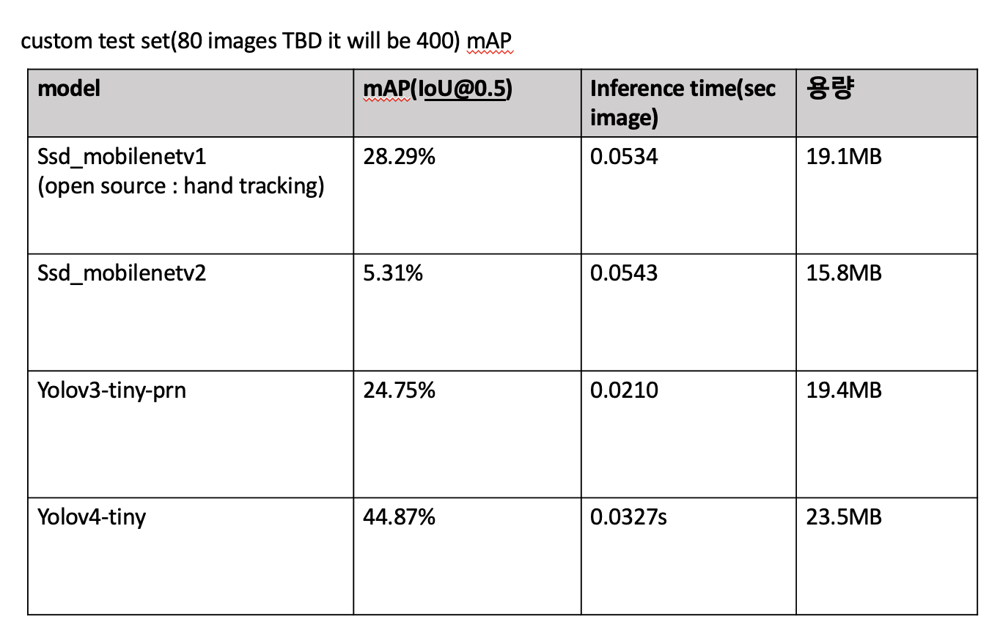

# hand_detection

## analysis result

#### test mAP & inference time & memory (추후 test set 80->400 images 될 예정)


#### validation mAP & inference time & memory (egohand evaluation data(400 images))


시간 관계상 open source에서 제공되는 ssdmobilenetv1은 모델 구조와 모델 가중치를 포함하는 .pb 를 그대로 사용하고, ssdmobilenetv2, yolov3-tiny-prn, yolov4-tiny에 대해서는 데이터를 수정하고, model config를 수정하여 직접 학습하였다.

분석 결과, validation set은 test data와 유사하기 때문에 높은 mAP를 보였지만, 자체 제작한 test 에서는 모두 성능이 떨어졌다.
그나마 general하게 작동하는 모델이 yolov4-tiny라는 것을 확인할 수 있다. 

따라서 yolov4-tiny에 다양한 각도의 hand data를 추가하여 fine tuning을 진행해보고자 한다.

### structure
```
.
├── README.md
├── dataset
│   ├── aug_utils
│   │   ├── bbox_util.py
│   │   ├── data_aug.py
│   ├── augmentation.py
│   ├── custom
│   │   ├── images
│   │   ├── ssd_annotations
│   │   ├── test_annotations
│   │   ├── yolo_annotations
│   │   └── xml2txt.py
│   ├── custom_augmentation.sh
│   ├── egohand
│   │   ├── egohands_data (will be removed)
│   │   │   ├── _LABELLED_SAMPLES
│   │   ├── images
│   │   ├── mat2txt.py
│   │   ├── ssd_annotations
│   │   ├── temp_annotations
│   │   └── yolo_annotations
│   ├── raw_custom
│   │   ├── video
│   │   ├── image2label.py
│   │   └── video2image.py
│   ├── egohand_augmentation.sh
│   ├── ssd_prepare.py 
│   └── test
│   └── validation
│   └── yolo_prepare.py
├── modules
│   ├── models
│   │   ├── ssdmobilenetv1
│   │   ├── ssdmobilenetv2
│   │   ├── yolov3-tiny
│   │   └── yolov4-tiny
│   ├── ssd_utils.py
│   └── yolo_utils.py
├── train
│   ├── ssdmobilenetv2
│   ├── yolov3-tiny
│   └── yolov4-tiny
├── valid_result
├── test_result
├── demo.py
├── evaluate_mAP.py
├── model.py
├── test.py
├── requirements.txt
├── README.md
└── venv
```

### custom dataset 
* situation
- each 2 people, 2 view points(옆, 앞)
  - 깍지손 (10초)
  - 필기 중인 손
  - 

## How to test?
0. 환경 구축 
 0-1. virtualenv 환경 구축
 0-2. requirement.txt 설치

1. dataset 준비
 1-1. label 을 txt로 변환하기 
   * egohand dataset(.mat -> .txt)
   ```bash
   $ cd dataset/{dataset_name}
   $ python mat2txt.py
   ```
   * custom dataset(.xml -> .txt)
     * video -> image
     raw_custom에 video 추가하기 
     ```bash
     $ cd raw_custom
     $ python video2image.py --video_dir videos
     ```

     * .xml label 생성 
    https://github.com/tzutalin/labelImg 참고하여 작성

     * .xml -> .txt
     ```bash
     $ cd dataset/{dataset_name}
     $ python xml2txt.py
     ```

     ```txt
     temp_annotations/train.txt , temp_annotations/test.txt 
      <image_name>,  <width>, <height>, <class>, <min_x>, <min_y>, <max_x>, <max_y>
      ```
 1-2. train/ test data split (9:1) of custom data
  ```bash
   $ cd dataset/{dataset_name}
   $ python split_data.py
   ```

 1-3. custom data yolo -> yolo 형식으로 변환
  ```bash
   $ cd dataset/{dataset_name}
   $ python yolo_prepare.py --name egohand
  ```

  ```txt
  [option]
  --name : egohand/ custom
  ```

  ```txt
  <class> <x_center> <y_center> <width> <height> (0~1 사이의 값으로 변환도 필요)
  ```

 1-4. custom data ssd -> ssd 형식으로 변환 (.tfrecord , .pbtxt)
 ```bash
   $ cd dataset/{dataset_name}
   $ python ssd_prepare.py --name egohand
  ```
  ```txt
  [option]
  --name : egohand/ custom
  ```

  ```txt
  .csv -> .tfrecord, .pbtxt 생성
  <image_path>, <width>, <height>, <class>, <min_x>, <min_y>, <max_x>, <max_y>
  ```

cf ) make validation set or test set for calculate mAP (.csv -> .txt)
<'class_name'> <'x_min'> <'y_min'> <'x_max'> <'y_max'>
```bash
$ cd dataset/
$ python python make_validation_annotation.py --valid_path {validation or test csv path}
```

 
2. test or demo
```bash
python test.py --eval_data dataset/test --ObjectDetection yolov4-tiny 
python demo.py --eval_data dataset/test --ObjectDetection yolov4-tiny 
```
  모듈로 embeded 함 
  test : ssdmobilenetv1 | ssd_mobilenetv2 | yolov4-tiny | yolov3-tiny
  demo : ssdmobilenetv1 | ssd_mobilenetv2 | yolov4-tiny | yolov3-tiny | google mediapipe palm detection
  결과는 test/{model_name}에 저장되도록 한다.

3. mAP 측정
다음과 같은 형태로 txt를 바꾸어준다.
```
ground_truth의 txt
dataset/test/{image_name}.txt 들의 형태 
<class_name> <left> <top> <right> <bottom> [<difficult>]

detection-result의 txt
<class_name> <confidence> <left> <top> <right> <bottom>
```

```bash
$ cd test
$ python evaluate_mAP.py --model {model_name}
```


## How to train with custom data & fine tuning?

0. 환경 구축 
 0-1. virtualenv 환경 구축
 0-2. requirement.txt 설치

1. dataset 준비
 1-1. label 을 txt로 변환하기 
   * egohand dataset(.mat -> .txt)
   ```bash
   $ cd dataset/{dataset_name}
   $ python mat2txt.py
   ```
   * custom dataset(.xml -> .txt)
     * video -> image
     raw_custom에 video 추가하기 
     ```bash
     $ cd raw_custom
     $ python video2image.py --video_dir videos
     ```

     * .xml label 생성 
    https://github.com/tzutalin/labelImg 참고하여 작성

     * .xml -> .txt
     ```bash
     $ cd dataset/{dataset_name}
     $ python xml2txt.py
     ```

     ```txt
     temp_annotations/train.txt , temp_annotations/test.txt 
      <image_name>,  <width>, <height>, <class>, <min_x>, <min_y>, <max_x>, <max_y>
      ```


 1-2. data augmentation
   ```bash
   # custom
   $ sh custom_augmentation.sh

   #egohand
   $ sh egohand_augmentation.sh
   ```

 1-3. train/ test data split (9:1)
  ```bash
   $ cd dataset/{dataset_name}
   $ python split_data.py
   ```

 1-4. yolo -> yolo 형식으로 변환
  ```bash
   $ cd dataset/{dataset_name}
   $ python yolo_prepare.py --name egohand
  ```

  ```txt
  [option]
  --name : egohand/ custom
  ```

  ```txt
  <class> <x_center> <y_center> <width> <height> (0~1 사이의 값으로 변환도 필요)
  ```

 1-5. ssd -> ssd 형식으로 변환 (.tfrecord , .pbtxt)
 ```bash
   $ cd dataset/{dataset_name}
   $ python ssd_prepare.py --name egohand
  ```
  ```txt
  [option]
  --name : egohand/ custom
  ```

  ```txt
  .csv -> .tfrecord, .pbtxt 생성
  <image_path>, <width>, <height>, <class>, <min_x>, <min_y>, <max_x>, <max_y>
  ```
 

2. train 
 2-1. {최종 Model} 에 대해 cfg 여러 개 작성
   - fine tuning
     - dataset split random ()
     - optimizer
     - freeze layer? (TBD)
 2-2. training

3. test
  각각 다른 cfg에 대해 test 수행


#### reference
* dataset
  - http://vision.soic.indiana.edu/projects/egohands/
* data labeling
  - https://github.com/tzutalin/labelImg
* data augmentation
  - https://github.com/Paperspace/DataAugmentationForObjectDetection  

* model
  - ssd_mobilenetv1
  https://github.com/victordibia/handtracking
  - ssd_mobilenetv2
  https://github.com/tensorflow/models
  - yolov3, yolov4
  https://github.com/AlexeyAB/darknet
  https://github.com/cansik/yolo-hand-detection 
  - google mediapipe palm detection
  https://github.com/google/mediapipe 

* evaluate mAP
    https://github.com/Cartucho/mAP