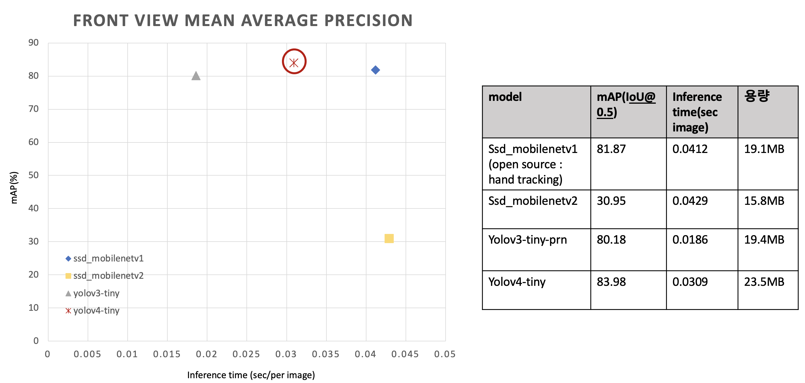

# hand_detection

## analysis result

#### test mAP & inference time & memory 
##### front view (100 images-->200 TBD.)


##### side view (280 images)


#### validation mAP & inference time & memory (egohand evaluation data(400 images))


#### 분석 
시간 관계상 open source에서 제공되는 ssdmobilenetv1은 모델 구조와 모델 가중치를 포함하는 .pb 를 그대로 사용하고, ssdmobilenetv2, yolov3-tiny-prn, yolov4-tiny에 대해서는 데이터를 수정하고, model config를 수정하여 직접 학습하였다.
  
validation set은 test data와 유사하기 때문에 높은 mAP를 보였지만, 자체 제작한 test 에서는 모두 성능이 떨어졌다.
그나마 general하게 작동하는 모델이 yolov4-tiny라는 것을 확인할 수 있다. 

yolov4의 경우, 기존의 YOLO에 Bag of freebies, Bag of specials 성능 향상 기법을 추가하고, universal한 feature를 추출하여 학습할 수 있도록 하였기 때문에 이와 같은 결과가 나왔을 것이라 생각한다. 
  
따라서 yolov4-tiny에 다양한 각도의 hand data를 추가하여 fine tuning을 진행해보고자 한다.

### structure
```
.
├── README.md
├── dataset
│   ├── aug_utils
│   │   ├── bbox_util.py
│   │   ├── data_aug.py
│   ├── augmentation.py
│   ├── custom
│   │   ├── front_view
│   │   ├── images
│   │   ├── side_view
│   │   ├── ssd_annotations
│   │   ├── test_annotations
│   │   ├── yolo_annotations
│   │   ├── images.txt
│   │   └── xml2txt.py
│   ├── custom_augmentation.sh
│   ├── egohand
│   │   ├── egohands_data (will be removed)
│   │   │   ├── _LABELLED_SAMPLES
│   │   ├── images
│   │   ├── mat2txt.py
│   │   ├── ssd_annotations
│   │   ├── temp_annotations
│   │   └── yolo_annotations
│   ├── raw_custom
│   │   ├── video
│   │   └── video2image.py
│   ├── egohand_augmentation.sh
│   ├── ssd_prepare.py 
│   ├── csv2txt.py 
│   ├── tests
│   ├── train
│   └── yolo_prepare.py
├── modules
│   ├── models
│   │   ├── ssdmobilenetv1
│   │   ├── ssdmobilenetv2
│   │   ├── yolov3-tiny
│   │   └── yolov4-tiny
│   ├── ssd_utils.py
│   └── yolo_utils.py
├── train
│   ├── ssdmobilenetv2
│   ├── yolov3-tiny
│   └── yolov4-tiny
├── valid_result
├── test_only_egohand
│   ├── test_result_front_view
│   └── test_result_side_view
├── demo.py
├── evaluate_mAP.py
├── model.py
├── test.py
├── requirements.txt
├── README.md
└── venv
```

### custom dataset 
- situation : each 5 people, 2 view points(front, side)
  - front view (100 images)
    - main action
      - writing
      - shaking
      - more actions ... (TBD)

  - side view (280 images)
    - main action
      - chining
      - drinking
      - shaking
      - streching
      - stroking
      - writing


## How to test?
0. 환경 구축 
 0-1. virtualenv 환경 구축
 ```bash
 $ cd hand_detection/
 $ virtualenv --python=3.7 venv
 $ source venv/bin/activate
 ```
 0-2. requirements.txt 설치
 ```bash
 $ pip install -r requirements.txt
 ```

<br />

1. dataset 준비
 1-1. label 을 txt로 변환하기 
   * egohand dataset(.mat -> .txt)
   ```bash
   $ cd dataset/{dataset_name}
   $ python mat2txt.py
   ```
   * custom dataset(.xml -> .txt)
     * video -> image
     raw_custom에 video 추가하기 
     ```bash
     $ cd raw_custom
     $ python video2image.py --video_dir videos
     ```

     * .xml label 생성 
    https://github.com/tzutalin/labelImg tool 활용 

    * cf ) make validation set or test set for calculate mAP (.xml-> .txt)
<'class_name'> <'x_min'> <'y_min'> <'x_max'> <'y_max'>

     ```bash
     $ cd dataset/{dataset_name}
     $ python xml2txt.py --mode test
     ```

     ```txt
     test_annotations/train.txt , test_annotations/test.txt 
      <image_name>,  <width>, <height>, <class>, <min_x>, <min_y>, <max_x>, <max_y>
      ```

 
  1-3. yolo train dataset 준비
  ```txt
  <class> <x_center> <y_center> <width> <height> (0~1 사이의 값으로 변환도 필요)
  ```

 1-4. custom data ssd -> ssd 형식으로 변환 (.tfrecord , .pbtxt)
 ```bash
   $ cd train/ssdmobilenetv2/workspace/
   $ python generate_tfrecord.py
  ```

  ```txt
  .csv -> .tfrecord, .pbtxt 생성
  <image_path>, <width>, <height>, <class>, <min_x>, <min_y>, <max_x>, <max_y>
  ```

+++ CMU dataset & oxford data 전처리 및 data split 하여 train.txt, test.txt 만들기
* CMU dataset (keypoint -> txt)
```bash
# 1-1. CMU로 directory change
$ cd dataset/CMUdataset

# 1-2. 원하는 keypoint 파일 .json -> .txt
# l,r 구분 지우고 .txt 파일 저장되도록 함
$ python keypoint2bbox.py --dataset_path {keypoint dataset path} --mode {train/test}

# 1-3. train.txt, test.txt 생성
$ python split_train_test.py
```

* oxford dataset (.mat -> yolo annotation .txt)
```bash
# 2-1. oxford로 directory change
$ cd dataset/oxford

# 2-2. .mat -> .txt 좌표 yolo 형식으로 수정
$ python singlemat2txt.py --mode {training/valiation/test}

# 2-3. train.txt, test.txt 생성
$ python split_train_test.py
```

##### dataset 비율 다양하게 실험하기
1-5. train, test 비율 정해주기 
이는 random으로 split 및 순서를 shuffling할 수 있도록 설계하였다.
```text
egohand , CMU, oxford(train+valid)
(4500 + 1000 + (4000+700)) , (500 + 440 + 800)
- only ego hand (4500,500)
    - train : 4500 (train.txt)
    - test : 500 (test.txt)
    - obj.data
    - obj.names
    - yolov4-tiny-custom.cfg

- egohand + CMU dataset + oxford = 2:1:2 → CMU dataset을 모두 사용하는 경우
    - train : 2000 + 1000 + 2000 (train_2_1_2.txt)
    - test : 500 + 250 + 500 (test_2_1_2.txt)
    - obj_2_1_2.data
    - yolov4-tiny_2_1_2.cfg
- egohand + CMU dataset + oxford = 4:1:4  → 양을 중요시 하는 경우
    - train : 4000 + 1000 + 4000 (train_4_1_4.txt)
    - test :  500+ 200 +600 (test_4_1_4.txt)
    - obj_4_1_4.data
    - yolov4-tiny_4_1_4.cfg
- egohand + CMU dataset + oxford = 8:1:4→ 가장 상황과 맞는 egohand dataset을 많이 활용하고 싶은 경우
    - train : 4000 + 500 + 2000 (train_8_1_4.txt)
    - test : 500 + 100 + 300 (test_8_1_4.txt)
    - obj_8_1_4.data
    - yolov4-tiny_8_1_4.cfg
```

```bash
# 비율에 따라 다르게 train.txt, test.txt 파일 생성
$ cd dataset/
$ python make_dataset_txt.py --mode {train/test} --ratio {2_1_2/4_1_4/8_1_4}
```

<br />

2. test or demo

* test : get inference time for sec/per image, get mAP
* demo : show detect result through opencv window
```bash
python test.py --eval_data dataset/{test dir}--ObjectDetection yolov4-tiny 
python demo.py --eval_data dataset/{test dir}--ObjectDetection yolov4-tiny 
```

``` txt
  모듈로 embeded 함 
  test : ssdmobilenetv1 | ssd_mobilenetv2 | yolov4-tiny | yolov3-tiny
  demo : ssdmobilenetv1 | ssd_mobilenetv2 | yolov4-tiny | yolov3-tiny | google mediapipe palm detection
  결과는 test/{model_name}에 저장되도록 한다.
```

<br />


## How to train with custom data & fine tuning?

* ssdmobilenetv2 : [how to train ssdmobilenetv2](train/ssdmobilenetv2)
* yolov3-tiny : [how to train yolov3-tiny](train/yolov3-tiny)
* yolov4-tiny : [how to train yolov4-tiny](train/yolov4-tiny)


#### reference
* dataset
  - http://vision.soic.indiana.edu/projects/egohands/
* data labeling
  - https://github.com/tzutalin/labelImg
* data augmentation
  - https://github.com/Paperspace/DataAugmentationForObjectDetection  

* model
  - ssd_mobilenetv1
  https://github.com/victordibia/handtracking
  - ssd_mobilenetv2
  https://github.com/tensorflow/models
  - yolov3, yolov4
  https://github.com/AlexeyAB/darknet
  https://github.com/cansik/yolo-hand-detection 
  - google mediapipe palm detection
  https://github.com/google/mediapipe 

* evaluate mAP
    https://github.com/Cartucho/mAP