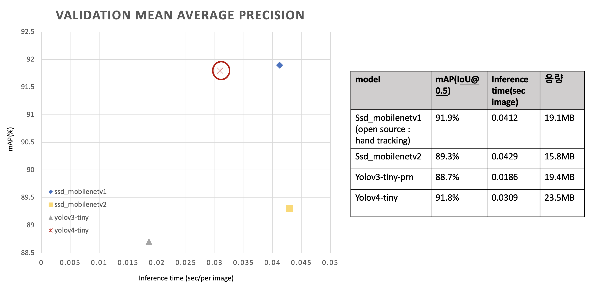

# hand_detection

## analysis result

### 1. 모델 선정

#### 모델 선정 프로세스

두 손 인식 모델을 선정하기 이전, 적은 수의 데이터셋에서 두 손 인식이 잘 되는 모델이 일반적으로 좋은 성능을 보일 것이라 가정하였다. 
두 손 인식 모델 선정을 위해 손 사진과 경계박스 좌표 데이터셋을  수집하고 SSD, YOLO 모델을 학습하였다. 모델을 전이 학습한 뒤, 직접 수집한 custom 데이터셋에서 좋은 성능을 보인 모델을 선정하였다. 성능 분석을 위해, IoU 0.5에서 mAP(mean average precision)을 측정하였다.
선정된 모델의 성능을 향상시키기 위해 데이터를 추가 수집한 뒤 다양한 비율로 학습하며 실험하였다. 최적의 데이터 비율을 찾은 후, optimizer와 data augmentation option에 대해 하이퍼 파라미터를 조정하여 최종 모델을 구축하였다.


#### condition1
- model : SSD_MobileNetv1, SSD_MobileNetv2, YOLOv4-tiny, YOLOv3-tiny
- train data : EgoHands dataset
  - EgoHands dataset : 48 Google Glass video 에서 게임하는 손에 대해 bounding box annotation, image 를 제공한다. 
- test data : custom data (labeling in person)
  - front view : 200
  - side view : 280


<br />

##### test mAP & inference time & memory 
###### front view


```text
- SSD_MobileNetv1
mAP : 78.55% , precision : 0.78 , recall : 0.84 , f1-score : 0.81

- SSD_MobileNetv2
mAP : 34.51% , precision : 0.36 , recall : 0.52 , f1-score : 0.43

- YOLOv3-tiny
mAP : 75.46% , precision : 0.90 , recall : 0.78 , f1-score : 0.84

- YOLOv4-tiny
mAP : 84.68% , precision : 0.89 , recall : 0.86 , f1-score : 0.87
```

###### side view (280 images)


```text
- SSD_MobileNetv1
mAP : 8.20% , precision : 0.29 , recall : 0.24 , f1-score : 0.26

- SSD_MobileNetv2
mAP : 3.70% , precision : 0.17 , recall : 0.12 , f1-score : 0.14 

- YOLOv3-tiny
mAP : 4.37% , precision : 0.45 , recall : 0.08 , f1-score : 0.14

- YOLOv4-tiny
mAP : 28.80% , precision : 0.65 , recall : 0.33 , f1-score : 0.44
```

##### validation mAP & inference time & memory EgoHands evaluation data(400 images))


<br />

#### 선택 모델
<mark style='background-color: #dcffe4'><b>YOLOv4-tiny</b></mark>

#### 모델 선정 근거
시간 관계상 open source에서 제공되는 SSD_MobileNetv1은 모델 구조와 모델 가중치를 포함하는 .pb 를 그대로 사용하고, SSD_MobileNetv2, YOLOv3-tiny, YOLOv4-tiny에 대해서는 데이터를 수정하고, model config를 수정하여 직접 학습하였다. 성능을 분석하기 위해 IoU 0.5에서 mAP(mean average precision)를 측정하였다.
  
validation set은 test data와 유사하기 때문에 높은 mAP를 보였지만, 자체 제작한 test 에서는 모두 성능이 떨어졌다.
그나마 general하게 작동하는 모델이 YOLOv4-tiny라는 것을 확인할 수 있다. 

YOLOv4의 경우, 기존의 YOLO에 Bag of freebies, Bag of specials 성능 향상 기법을 추가하고, universal한 feature를 추출하여 학습할 수 있도록 하였기 때문에 이와 같은 결과가 나왔을 것이라 생각한다. 
  
따라서 <mark style='background-color: #dcffe4'>YOLOv4-tiny</mark>에 다양한 각도의 hand data를 추가하여 fine tuning을 진행해보고자 한다.

<br />
<br />

### 2. 성능 향상 기법 연구 
#### 2-1. dataset 추가 수집 및 비율을 다르게 train & test

##### condition2
- model : YOLOv4-tiny
- train data : EgoHands dataset, CMU dataset, oxford dataset
  - CMU dataset : MPII, NZSL 등의 실제 도메인 이미지에 대해 hand keypoint 좌표 데이터셋을 제공한다. hand keypoint 좌표를 통해 min_x, min_y, max_x, max_y 값을 구하여 hand bounding box 좌표를 구하는 방식으로 annotation dataset을 수집하였다.
  - oxford : PASCAL_VOC, Movie Dataset 등의 공개 데이터셋을 활용한 것으로 bounding box annotation, image 를 제공한다. 
- test data : custom data (labeling in person)
  - front view : 200
  - side view : 280


```text
사용한 train EgoHands , CMU, oxford(train+valid) / validation 
(4500 + 1000 + (4000+700)) / (500 + 440 + 800)
- only EgoHands(4500,500)
    - train : 4500 (train.txt)
    - validation : 500 (test.txt)
    - obj.data
    - obj.names
    - yolov4-tiny-custom.cfg

- EgoHands + CMU dataset + oxford = 2:1:2 → dataset을 골고루 섞은 경우 
    - train : 2000 + 950 + 2000 (train_2_1_2.txt)
    - validation : 500 + 250 + 500 (test_2_1_2.txt)
    - obj_2_1_2.data

- EgoHands + CMU dataset + oxford = 4:1:4  → 데이터 양을 중요시 하는 경우
    - train : 4000 + 950 + 4000 (train_4_1_4.txt)
    - validation validation :  500+ 200 +600 (test_4_1_4.txt)
    - obj_4_1_4.data

- EgoHands + CMU dataset + oxford = 8:1:4→ 가장 상황과 맞는 EgoHands dataset을 많이 활용하고 싶은 경우
    - train : 4000 + 500 + 2000 (train_8_1_4.txt)
    - validation validation : 500 + 100 + 300 (test_8_1_4.txt)
    - obj_8_1_4.data
```

##### test mAP


```text
- front view
  - only EgoHands
    mAP : 84.68% , precision : 0.89 , recall : 0.86 , f1-score : 0.87

  - EgoHands + CMU dataset + oxford = 2:1:2 
    mAP : 92.10% , precision : 0.98 , recall : 0.92 , f1-score : 0.95

  - EgoHands + CMU dataset + oxford = 4:1:4 
    mAP : 81.33% , precision : 0.93 , recall : 0.88 , f1-score : 0.88

  - EgoHands + CMU dataset + oxford = 8:1:4
    mAP : 89.81% , precision : 0.96 , recall : 0.90 , f1-score : 0.93

-side view
  - only EgoHands
    mAP : 28.80% , precision : 0.65 , recall : 0.33 , f1-score : 0.44

  - EgoHands + CMU dataset + oxford = 2:1:2 
    mAP : 48.85% , precision : 0.92 , recall : 0.51 ,f1-score : 0.66

  - EgoHands + CMU dataset + oxford = 4:1:4 
    mAP : 48.95% , precision : 0.91 , recall : 0.51 ,f1-score : 0.65

  - EgoHands + CMU dataset + oxford = 8:1:4
    mAP : 46.95% , precision : 0.90 , recall : 0.50 ,f1-score : 0.64
```

<br />

##### 결과 분석

CMU, oxford data를 추가하여 데이터를 다양하게 하였기 때문에 front view, side view에서 눈에 띄게 성능이 향상된 것을 확인할 수 있다.

EgoHands:CMU:oxford=2:1:2의 경우, 기존 모델과 데이터의 양은 비슷하지만, real domain data들이 추가되었기 때문에 데이터의 다양성으로 기존보다 front view에서 10%, side view에서 20%의 성능을 향상시킬 수 있었다.

EgoHands:CMU:oxford=4:1:4의 경우, 가장 데이터가 많은 모델이다. side view data가 추가되어 side view에서는 20% 성능을 향상시켰지만, front view data에서는 드라마틱한 성장을 보이지 못하였다. 이를 통해, 데이터의 수가 무조건 많은 것보다 데이터의 품질(다양성)이 중요하다는 것을 알 수 있다.

EgoHands:CMU:oxford=8:1:4의 경우, front view에서는 약 5%의 향상을 보이고, side view에서는 18%의 성능 향상을 보여주었다. EgoHands data가 시험 환경과 비슷할 것이라고 예측하여 Egohands 데이터 비율을 많이 한 것으로, 실제로 Front view에서 높은 mAP를 확인할 수 있다. 

EgoHands:CMU:oxford 2:1:2과 8:1:4가 성능이 비슷하여, real time WebCamera로 실험해보았다. 그 결과 yolov4-tiny_2_1_2가 background error를 덜 인식하므로 <mark style='background-color: #dcffe4'>yolov4-tiny_2_1_2</mark>를 선택하기로 하였다.

<br />

#### 2-2. 최적의 dataset에서 optimizer 수정 및 Bag of Freebies 적용

##### condition3

- model : yolov4-tiny
- train data : EgoHands dataset, CMU dataset, oxford dataset = 2000:950:2000 
- test data : custom data (labeling in person)
  - front view : 200
  - side view : 280
- modify things
  - 0. default
  - 1. optimizer : momentum -> adam
  - 2. add data augmetation option mosaic

<br />

##### test mAP


```text
- front view
  - default
    mAP : 92.10% , precision : 0.98 , recall : 0.92 , f1-score : 0.95

  - modify optimizer : momentum -> adam
    mAP : 80.4% , precision : 0.94 , recall : 0.82 , f1-score : 0.88

  - add data augmetation option mosaic
    mAP : 79.47% , precision : 0.90 , recall : 0.81 , f1-score : 0.85

-side view
  - default
    mAP : 48.85% , precision : 0.92 , recall : 0.51 ,f1-score : 0.66

  - modify optimizer : momentum -> adam
    mAP : 50.66% , precision : 0.92 , recall : 0.53 ,f1-score : 0.67

  - add data augmetation option mosaic
    mAP : 39.71% , precision : 0.83 , recall : 0.44 ,f1-score : 0.58
```


<br />

##### 결과 분석

mAP를 측정해본 결과, optimizer은 adam보다 momentum이 더 좋은 성능을 보인다는 것을 알 수 있었다. training 시 data augmentation을 위해, saturation, exposure, hue을 하는 것에 mosaic을 추가하면 성능이 오히려 떨어지는 것을 확인할 수 있었다.

최종적으로 선택한 모델은 **yolov4-tiny** 이고, option은 다음과 같다.
- dataset = EgoHands dataset, CMU dataset, oxford dataset = 2000:950:2000 
- optimizer : momentum
- data augmentation : saturation, exposure, hue

<br />
<br />
<br />

## structure
```
.
├── README.md
├── dataset
│   ├── custom
│   │   ├── front_view
│   │   ├── images
│   │   ├── side_view
│   │   ├── ssd_annotations
│   │   ├── test_annotations
│   │   ├── yolo_annotations
│   │   ├── images.txt
│   │   └── xml2txt.py
│   ├── egohand
│   │   ├── egohands_data (will be removed)
│   │   │   ├── _LABELLED_SAMPLES
│   │   ├── images
│   │   ├── mat2txt.py
│   │   ├── ssd_annotations
│   │   ├── temp_annotations
│   │   └── yolo_annotations
│   ├── raw_custom
│   │   ├── video
│   │   └── video2image.py
│   ├── csv2txt.py 
│   ├── tests
│   ├── train
│   └── make_dataset_txt.py
├── modules
│   ├── models
│   │   ├── ssdmobilenetv1
│   │   ├── ssdmobilenetv2
│   │   ├── yolov3-tiny
│   │   └── yolov4-tiny
│   ├── ssd_utils.py
│   └── yolo_utils.py
├── train
│   ├── ssdmobilenetv2
│   ├── yolov3-tiny
│   └── yolov4-tiny
├── valid_result
│   ├── ssdmobilenetv1
│   ├── ssdmobilenetv2
│   ├── yolov3-tiny
│   └── yolov4-tiny
├── test_result
│   ├── test_2_1_2
│   ├── test_4_1_4
│   ├── test_8_1_4
│   └── test_only_egohand
├── demo.py
├── evaluate_mAP.py
├── model.py
├── test.py
├── requirements.txt
├── README.md
└── venv
```

### custom dataset 
- situation : each 5 people, 2 view points(front, side)
  - front view (100 images)
    - main action
      - writing
      - shaking
      - more actions ... (TBD)

  - side view (280 images)
    - main action
      - chining
      - drinking
      - shaking
      - streching
      - stroking
      - writing


## How to test?

0. 환경 구축 

 0-1. virtualenv 환경 구축
 ```bash
 $ cd hand_detection/
 $ virtualenv --python=3.7 venv
 $ source venv/bin/activate
 ```
 0-2. requirements.txt 설치
 ```bash
 $ pip install -r requirements.txt
 ```

<br />

1. test dataset 준비
  * custom dataset(.xml -> .txt)
    * video -> image
    raw_custom에 video 추가하기 
    ```bash
    $ cd raw_custom
    $ python video2image.py --video_dir videos
    ```

    * .xml label 생성 
    https://github.com/tzutalin/labelImg tool 활용 

    * cf ) make validation set or test set for calculate mAP (.xml-> .txt)
    <'class_name'> <'x_min'> <'y_min'> <'x_max'> <'y_max'>
    ```bash
    $ cd dataset/custom
    $ python xml2txt.py --mode test
    ```

cf ) how to get pretrained .weights?
i. [releases](https://github.com/DA-sc21/hand_detection/releases) 에서 weights 다운로드

ii. wget으로 weights 얻기 
```bash
# SSD_MobileNetv1
$ wget https://github.com/DA-sc21/hand_detection/releases/latest/download/ssdmobilenetv1.zip

# SSD_MobileNetv2
$ wget https://github.com/DA-sc21/hand_detection/releases/latest/download/ssdmobilenetv2.zip

# YOLOv3-tiny
$ wget https://github.com/DA-sc21/hand_detection/releases/latest/download/yolov3-tiny.zip

# YOLOv4-tiny
$ wget https://github.com/DA-sc21/hand_detection/releases/latest/download/yolov4-tiny.zip
```

2. demo or test
* demo : show detect result through opencv window -> ground truth 없이 이미지 dataset만 있다면 가능하다.
다음과 같이 특정 모델에 대해 예측 결과 bounding box를 openCV window로 확인할 수 있다. 


* test : get inference time for sec/per image, get mAP -> ground truth가 있는 dataset에 대해 가능하다. 
다음과 같은 output.txt를 얻을 수 있다. 얻어진 fp, tp, total num of detect hands, total num of groundtruth hands 를 통해 Recall, precision을 구할 수 있다.


```bash
$ python demo.py --eval_data dataset/{test dir}--ObjectDetection yolov4-tiny --mode {check under txt} --option {check under txt}
$ python test.py --eval_data dataset/{test dir}--ObjectDetection yolov4-tiny --mode {check under txt} --option {check under txt}
```
<br />
```text
argument
[--eval_data] : test dataset path
[--ObjectDetection] : ssdmobilenetv1 | ssd_mobilenetv2 | yolov4-tiny | yolov3-tiny 
[--mode] : 1_0_0 | 2_1_2 | 4_1_4 | 8_1_4 -> yolov4-tiny dataset 비중 (egohands : CMU : oxford)
[--option] : no | optimizer | augmentation (egohands : CMU : oxford=2:1:2에서 option을 다르게 훈련한 경우)
```
``` text
  모듈로 embeded 함 
  test : ssdmobilenetv1 | ssd_mobilenetv2 | yolov4-tiny | yolov3-tiny 
  demo : ssdmobilenetv1 | ssd_mobilenetv2 | yolov4-tiny | yolov3-tiny | google mediapipe palm detection
  결과는 test/{model_name}에 저장되도록 한다.
```


<br />

## How to train ? What is method ?
### train code
* SSD_MobileNetv2 : [how to train SSD_MobileNetv2](train/ssdmobilenetv2)
* YOLOv3-tiny : [how to train yolov3-tiny](train/YOLOv3-tiny)
* YOLOv4-tiny : [how to train yolov4-tiny](train/YOLOv4-tiny)


## How to train with data & fine tuning (ft. YOLOv4-tiny)?
### dataset 비율 다양하게 실험하기

1. dataset 준비
-> 전처리 및 data split

```text
<class> <x_center> <y_center> <width> <height> (0~1 사이의 값으로 변환도 필요)
```  

  1-1. egohand dataset
   * .mat -> .txt
   ```bash
   $ cd dataset/egohand
   $ python mat2txt.py
   ```
  
   1-2. CMU dataset (keypoint -> txt)
  ```bash
    # 1-1. CMU로 directory change
    $ cd dataset/CMUdataset
    
    # 1-2. 원하는 keypoint 파일 .json -> .txt
    # l,r 구분 지우고 .txt 파일 저장되도록 함
    $ python keypoint2bbox.py --dataset_path {keypoint dataset path} --mode {train/test}
    
    # 1-3. train.txt, test.txt 생성
    $ python split_train_test.py
  ```


   1-3.  oxford data (.mat -> yolo annotation .txt)
  ```bash
    # 2-1. oxford로 directory change
    $ cd dataset/oxford

    # 2-2. .mat -> .txt 좌표 yolo 형식으로 수정
    $ python singlemat2txt.py --mode {training/valiation/test}

    # 2-3. train.txt, test.txt 생성
    $ python split_train_test.py
  ```

2. train, test 비율 정해주기 
이는 random으로 split 및 순서를 shuffling할 수 있도록 설계하였다.
[Go to method of split](#condition2)
```bash
# 비율에 따라 다르게 train.txt, test.txt 파일 생성
$ cd dataset/
$ python make_dataset_txt.py --mode {train/test} --ratio {2_1_2/4_1_4/8_1_4}
```

<br />


## cf ) 모든 성능 한 눈에 보기

#### front_view(custom data)

| model | train data | option | mAP | precision | recall | f1-score |
| --- | --- |  --- |  --- |  --- |  --- |  --- | 
| ssd_mobilenetv1 | only EgoHands | X | 78.55% | 0.78 | 0.84 |  0.81 | 
| ssd_mobilenetv2 | only EgoHands| X | 34.51% | 0.36 | 0.52 | 0.43 | 
| yolov3-tiny | only EgoHands | X | 75.46% | 0.90 | 0.78 |  0.84 | 
| yolov4-tiny | only EgoHands | X | 84.68% | 0.89 | 0.86 | 0.87 |  
| --- | --- |  --- |  --- |  --- |  --- |  --- | 
| 1. 성능 향상을 위한 dataset 비율 수정 |||||||
| **yolov4-tiny** | **EgoHands:CMU:oxford= 2000:950:2000** | X | **92.10%** | 0.98 | 0.92 | 0.95 | 
| yolov4-tiny| EgoHands:CMU:oxford=4000:950:4000 | X | 81.33% | 0.93 | 0.88 | 0.88 | 
| yolov4-tiny | EgoHands:CMU:oxford=4000:500:2000 | X | 89.81% | 0.96 | 0.90 | 0.93 | 
| --- | --- |  --- |  --- |  --- |  --- |  --- | 
| 2. 성능 향상을 위한 optimizer, data augmentation option 수정|||||||
| yolov4-tiny| EgoHands:CMU:oxford=2000:950:2000 | optimizer : momentum -> adam | 80.4% | 0.94 | 0.82 | 0.88 | 
| yolov4-tiny | EgoHands:CMU:oxford=2000:950:2000 |data aug. : add mosaic | 79.47% | 0.90 | 0.81 | 0.85 |

#### side_view(custom data)
| model | train data | option | mAP | precision | recall | f1-score |
| --- | --- |  --- |  --- |  --- |  --- |  --- | 
| ssd_mobilenetv1 | only EgoHands | X | 8.20% | 0.29 | 0.24 | 0.26 | 
| ssd_mobilenetv2 | only EgoHands| X | 3.7% | 0.17 | 0.12 | 0.14 | 
| yolov3-tiny | only EgoHands | X | 4.37% | 0.45 | 0.08 | 0.14 | 
| yolov4-tiny | only EgoHands | X | 28.80% | 0.65 | 0.33 | 0.44 | 
| --- | --- |  --- |  --- |  --- |  --- |  --- | 
| 1. 성능 향상을 위한 dataset 비율 수정 |||||||
| yolov4-tiny | EgoHands:CMU:oxford= 2000:950:2000| X | 48.85% | 0.92 | 0.51 | 0.66 | 
| yolov4-tiny| EgoHands:CMU:oxford=4000:950:4000 | X | 48.95% | 0.91 | 0.51 | 0.65 | 
| yolov4-tiny | EgoHands:CMU:oxford=4000:500:2000 | X | 46.95% | 0.90 | 0.50 | 0.64 | 
| --- | --- |  --- |  --- |  --- |  --- |  --- | 
| 2. 성능 향상을 위한 optimizer, data augmentation option 수정|||||||
| yolov4-tiny| EgoHands:CMU:oxford=2000:950:2000 | optimizer : momentum -> adam | 50.66% | 0.92 | 0.53 | 0.67 | 
| yolov4-tiny | EgoHands:CMU:oxford=2000:950:2000 |data aug. : add mosaic | 39.71% | 0.83 | 0.44 | 0.58 |

<br />

### reference
* dataset
  - EgoHands
  http://vision.soic.indiana.edu/projects/egohands/
  - CMU dataset
  http://domedb.perception.cs.cmu.edu/handdb.html
  - oxford
  https://www.robots.ox.ac.uk/~vgg/data/hands/

* data labeling
  - https://github.com/tzutalin/labelImg
  
* data augmentation (But not use in this experiment)
  - https://github.com/Paperspace/DataAugmentationForObjectDetection  

* model
  - ssd_mobilenetv1
  https://github.com/victordibia/handtracking
  - ssd_mobilenetv2
  https://github.com/tensorflow/models
  - yolov3, yolov4
  https://github.com/AlexeyAB/darknet
  https://github.com/cansik/yolo-hand-detection 
  - google mediapipe palm detection
  https://github.com/google/mediapipe 

* evaluate mAP
    https://github.com/Cartucho/mAP